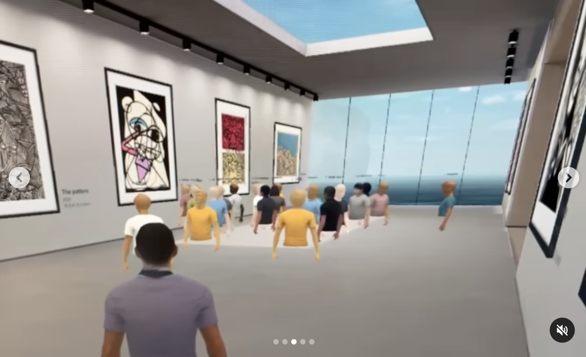

# 요즘 드는 생각, 내가 선택한 길

## 신선한 충격, '재미있는 것'

얼마전에 **천인우**님께서 SNS에 올리신 글이 저에게 **신선한 충격**을 주었기에 내용을 공유드리려 합니다.
 
 

<em>"가상 전시회" 사이드 프로젝트, 출처 : 천인우님 인스타그램 </em>

> **재미있는 거 해보자!**

위의 한마디에 **개발자와 예술가 등 다양한 배경**을 가지신 분들이 팀원으로 모여 “가상 전시회"를 만드는 **사이드 프로젝트** 진행했다고 합니다. 

자세한 내용은 해당 [링크](https://www.instagram.com/p/Cc4HA7DF1tf/?utm_source=ig_web_copy_link)를 통해 보시는 것을 추천합니다.

 

해당 게시글을 처음 봤을 때는 그저 재미있어 보인다고만 생각했습니다.

하지만 시간이 지나니 **"재미있는 거 해보자"라는 말로부터 팀 결성부터 열정을 바친 프로젝트 진행까지 모든 것이 이루어진 사실**이 한동안 머릿속에 맴돌더라고요.

자연스럽게 현재의 **'개발 생활을 재미있게 즐기고 있을까?'**부터 시작해서, **왜 개발을 시작했는지**에 대해 반추하게 되었습니다.

## 내가 되고 싶던 개발자

무엇이든 코드를 통하여 만들 수 있는 **개발자가 마치 ‘창조주'처럼 느껴졌습니다.** 
또한, 이를 통해서 **세상을 변화시킬 수 있다**는 점에 매료되었습니다.

즉, **<u>코드로 사회를 바꿀 수 있는 무언가를 만들기 위해</u>** 관련 공부를 시작했습니다.

 
하지만 현재의 저는 어떨까요? 창조하기는커녕 그저 **코드를 반복해서 치는 ‘코드쟁이'**에 불과하고,  아직 배울게 많아 그저 **골방에 틀어박혀 공부**만 하고 있더라고요.

문득, 이렇게 **'공부한 지식들이 세상 밖으로 표출되지 않는다면 결국 무슨 의미가 있을까'**라는 생각이 들었습니다. 
꼭 공부가 완벽해야 무언가를 만들 수 있는 것도 아닌데, 저만의 틀에 갇혀 완성을 한 후에 하려고 했던 것 같습니다.

**재미있게 개발을 할 수 있었음에도 재미없게 했다**는 것이죠.

## 앞으로는...

큰 자원의 제약 없이 **코드로 원하는 것을 만들 수 있는**(물론 공부는 많이 필요하지만) **제가 선택한 길**이 너무나 사랑스럽고 만족스럽습니다. 
또한 **수많은 관련 지식들을 몇 번의 검색만으로 얻을 수 있는 시대**에 태어난 것을 너무 행복합니다.

 
현재를 즐기면서 모든 것을 활용하여 **'창조'하는 행위에 조금은 더 집중**하여 열정을 불태우려 합니다.

 
비록 아직은 **가슴속에서 시작된 조그마한 다짐**에 불과하지만, **오랫동안 싸워온 난제를 해결한 것 같아 정말 개운하네요.**

 

---
 
기획자, 디자이너, 예술가 등 **사이드 프로젝트에 관심이 있으신 분**들은 언제든지 연락 주세요.

>**“같이 재미있는거 해봐요!”** 
**_Enjoy Coding!_**