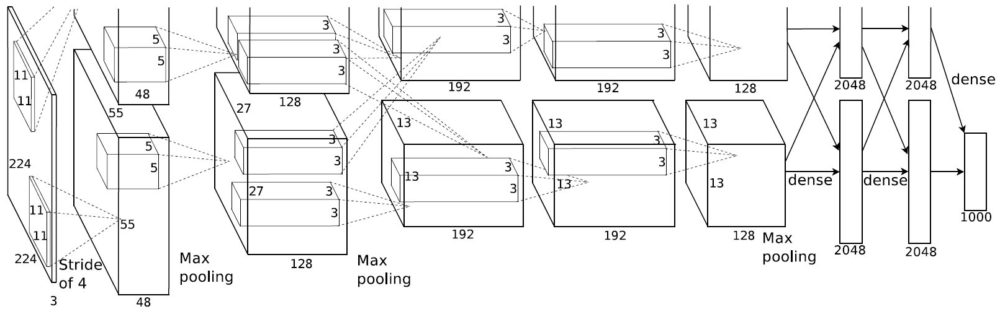
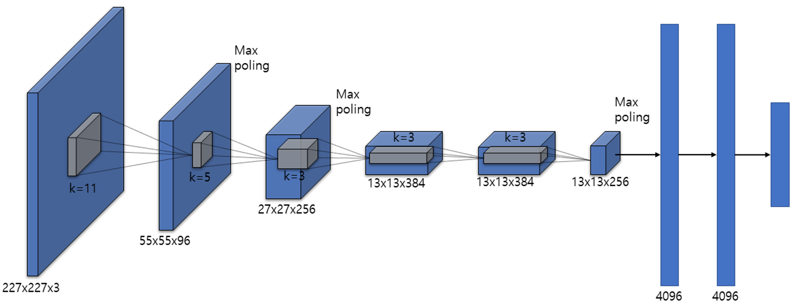

# [논문 리뷰 및 구현] AlexNet(2012) 리뷰 및 파이토치(PyTorch) 구현

## AlexNet

2012년 ILSVRC(ImageNet Large-Scale Visual Recognition Challenge) 대회에서  2위와 큰 차이를 가지고 SOTA(state-of-the-art)를 달성하였습니다.

이 논문으로 인해 CNN이 크게 주목을 받게 되었으며, 이후 비전 분야에서 딥러닝이 보편화되기 시작하였습니다.

### Architecture



**5개의 convolutional layer**와 **3개의 fully-connected layer**로 이루어져 있습니다.

또한 다음의 방법들로 구성되어 있습니다.

- ReLU Nonlinearity
- Multiple GPUs
- Local Response Normalization
- Overlapping Pooling

이외에도 Overfitting을 방지하기 위하여 Data Augmentation을 활용하였으며, fully-connected layers  첫 두 부분에 Dropout을 적용하였습니다.

당시에는 GPU의 자원이 한정되어 있어 병렬로 학습을 진행하였는데, 현재로는 하나의 GPU로도 충분히 학습이 가능하기에 구조를 다음과 같이 바꾸어 구현하였습니다.

### PyTorch Implementation



```python
class Alexnet(torch.nn.Module):
    def __init__(self, in_channels, num_classes):
        super().__init__()
        
        self.layer1 = torch.nn.Sequential(
            torch.nn.Conv2d(in_channels, 96, kernel_size=11, stride=4), # conv1
            torch.nn.ReLU(inplace=True),
            torch.nn.LocalResponseNorm(2),
            torch.nn.MaxPool2d(kernel_size=3, stride=2)
        )
        
        self.layer2 = torch.nn.Sequential(
            torch.nn.Conv2d(96, 256, kernel_size=5, stride=1, padding=2), # conv2
            torch.nn.ReLU(inplace=True),
            torch.nn.LocalResponseNorm(2),
            torch.nn.MaxPool2d(kernel_size=3, stride=2)
        )
        
        self.layer3 = torch.nn.Sequential(
            torch.nn.Conv2d(256, 384, kernel_size=3, stride=1, padding=1), # conv3
            torch.nn.ReLU(inplace=True)
        )
        
        self.layer4 = torch.nn.Sequential(
            torch.nn.Conv2d(384, 384, kernel_size=3, stride=1, padding=1), # conv4
            torch.nn.ReLU(inplace=True)
        )
        
        self.layer5 = torch.nn.Sequential(
            torch.nn.Conv2d(384, 256, kernel_size=3, stride=1, padding=1), # conv5
            torch.nn.ReLU(inplace=True),
            torch.nn.MaxPool2d(kernel_size=3, stride=2)
        )
	
				self.avgpool = torch.nn.AdaptiveAvgPool2d((6,6))				

        self.classifier = torch.nn.Sequential(
            torch.nn.Linear(6*6*256, 4096), # fc1
            torch.nn.ReLU(inplace=True),
            torch.nn.Dropout(0.5),
            torch.nn.Linear(4096, 4096), # fc2
            torch.nn.ReLU(inplace=True),
            torch.nn.Dropout(0.5),
            torch.nn.Linear(4096, num_classes) # fc3
        )
        
    def forward(self, x):
        x = self.layer1(x)
        x = self.layer2(x)
        x = self.layer3(x)
        x = self.layer4(x)
        x = self.layer5(x)
				x = self.avgpool(x)
        x = torch.flatten(x, 1)
        return self.classifier(x)
```

직접 ImageNet으로 학습을 하는 것은 한계가 있기에, CIFAR-10으로 진행하였습니다.

Jupyter notebook으로 정말 간단하게 코드를 구현하였고, 다음 링크에서 직접 확인하실 수 있으며 코드를 직접 돌려보실 수 있습니다.

[구현 코드 전문](https://github.com/Devlee247/PyTorch-Implementations/blob/master/CNN/AlexNet.ipynb)

### 구현 포인트

- ReLU, LRN, Dropout 순서
- MaxPool 위치
- AdaptiveAvgPool

### 마무리

워낙에 유명한 논문이라서 이미 알고는 있었지만, 논문 하나하나 살펴가면서 ‘왜 이걸 여기에 썼을까?’ 고민하면서 정말 많이 배웠습니다. 특히 당시 시대 상황을 고려하여서 이런 고민을 했었겠구나 생각도 들었으며, Dropout과 ReLU가 어떤 시대적 흐름을 가지고 적용되어왔는지 살펴볼 수 있어 좋았습니다.

물론 LRN이 지금 쓰이지는 않지만, ReLU와의 연관성을 가지고 아이디어를 낸 부분을 보면서 앞으로 연구를 진행함에 있어서 어떤 마인드셋과 인과관계를 거치고 진행해야 하는지 배울 수 있었습니다.

## 참고자료

[https://proceedings.neurips.cc/paper/2012/file/c399862d3b9d6b76c8436e924a68c45b-Paper.pdf](https://proceedings.neurips.cc/paper/2012/file/c399862d3b9d6b76c8436e924a68c45b-Paper.pdf)