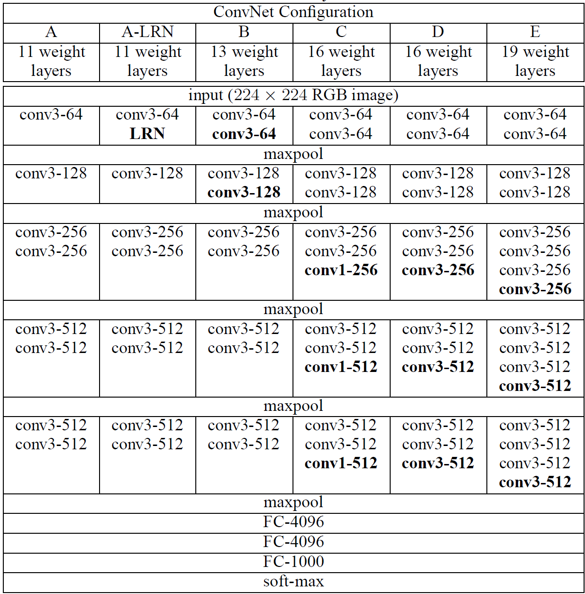

# [논문 리뷰 및 구현] VGGNet(2014) 리뷰 및 파이토치(PyTorch) 구현

## VGGNet

- 당시 Convolutional networks가 잘 되는 것을 보고, 다른 연구자들은 성능을 높이기 위해 다양한 시도를 해왔습니다. 본 논문에서는 성능을 높이기 위해 Depth를 늘리는 방향으로 진행했다고 합니다.
- 특히, 3x3 convolution filters를 사용해서 depth를 늘린 후 다양한 평가를 진행했습니다.

### Architecture



- 3x3 Convolution을 활용하여 다양한 receptive field를 가질 수 있도록 하였습니다.

### PyTorch Implementation

```python
layer_configs = {
    "A" : [(3,64), 'M', (3,128), 'M', (3,256), (3,256), 'M', (3,512), (3,512), 'M', (3,512), (3,512), 'M'],
    "A-LRN" : [(3,64), 'LRN', 'M', (3,128), 'M', (3,256), (3,256), 'M', (3,512), (3,512), 'M', (3,512), (3,512), 'M'],
    "B" : [(3,64), (3,64), 'M', (3,128), (3,128), 'M', (3,256), (3,256), 'M', (3,512), (3,512), 'M', (3,512), (3,512), 'M'],
    "C" : [(3,64), (3,64), 'M', (3,128), (3,128), 'M', (3,256), (3,256), (1,256), 'M', (3,512), (3,512), (1,512), 'M', (3,512), (3,512), (1,512), 'M'],
    "D" : [(3,64), (3,64), 'M', (3,128), (3,128), 'M', (3,256), (3,256), (3,256), 'M', (3,512), (3,512), (3,512), 'M', (3,512), (3,512), (3,512), 'M'],
    "E" : [(3,64), (3,64), 'M', (3,128), (3,128), 'M', (3,256), (3,256), (3,256), (3,256), 'M', (3,512), (3,512), (3,512), (3,512), 'M', (3,512), (3,512), (3,512), (3,512), 'M'],
}
```

- 위에 나와있는 ConvNet Configuration에 맞춰서 먼저 list를 생성했습니다

```python
def make_layer(in_channels, layers):
    modules = []
    
    in_channels = in_channels
    for layer_type in layers:
        if layer_type == "M":
            modules.append(nn.MaxPool2d(kernel_size=2, stride=2))
        elif layer_type == "LRN":
            modules.append(nn.LocalResponseNorm(2))
        else:
            k, layer = layer_type
            modules.append(nn.Conv2d(in_channels, layer, kernel_size=k, padding=1))
            modules.append(nn.ReLU(inplace=True))
            in_channels = layer
    
    return nn.Sequential(*modules)
```

- 이후 들어오는 인자에 맞춰서 레이어를 생성하였습니다.

```python
class VGGNet(torch.nn.Module):
    def __init__(self, in_channels, num_classes, layer_config="A"):
        super().__init__()
        
        layers = layer_configs[layer_config]
        
        self.features = make_layer(in_channels, layers)
        self.avgpool = torch.nn.AdaptiveAvgPool2d((7,7))
        self.classifier = torch.nn.Sequential(
            torch.nn.Linear(7*7*512, 4096),
            torch.nn.ReLU(inplace=True),
            torch.nn.Dropout(0.5),
            torch.nn.Linear(4096, 4096),
            torch.nn.ReLU(inplace=True),
            torch.nn.Dropout(0.5),
            torch.nn.Linear(4096, num_classes)
        )
        
    def forward(self, x):
        x = self.features(x)
        x = self.avgpool(x)
        x = torch.flatten(x, 1)
        return self.classifier(x)
```

- VGGNet의 코드는 위와 같습니다.

- 특히 3x3 conv를 사용할 때는 padding을 1로 고정하여 spatial resolution이 연산 후에도 보존될 수 있도록 하였습니다.
- Spatial pooling으로 max-pooling을 이용하였고, 2x2 window와 stride를 2로 설정하여 사용하였습니다.
- FC layers는 3개로 구성되어 있습니다.

코드 전문은 제 [깃허브](https://github.com/Devlee247/PyTorch-Implementations/blob/master/CNN/VGGNet.ipynb)에서 확인하실 수 있습니다.

### 구현 포인트

- 3x3 convolution
- make_layer 활용

### 마무리

convolution의 kernel size와 receptive field에 대해 다시 한번 생각해볼 수 있어서 정말 좋았습니다. 이전까지는 kernel size를 7과 11 같이 크게하여 사용을 하였는데, 본 논문에서는 3으로만 제한하고 흥미로웠고, 3x3 필터를 여러번 중첩시키면서 5x5 & 7x7의 receptive field 가져가게 된 논리적 흐름을 다시 한번 확인할 수 있어서 좋았습니다.

다음 구현부터는 resolution이 조금 더 큰 데이터셋을 사용해볼까 생각이 드네요.

## 참고자료
[https://arxiv.org/pdf/1409.1556.pdf](https://arxiv.org/pdf/1409.1556.pdf)