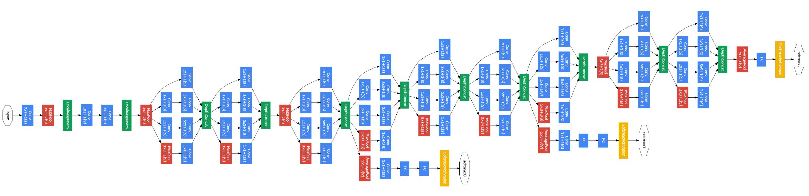
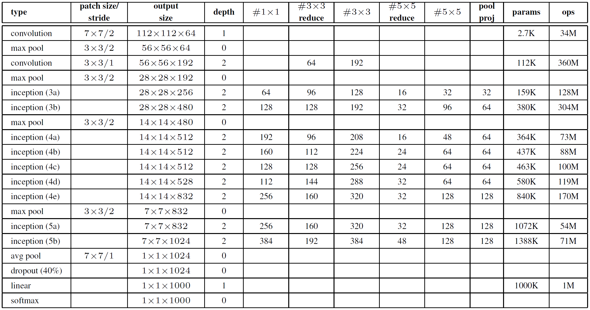
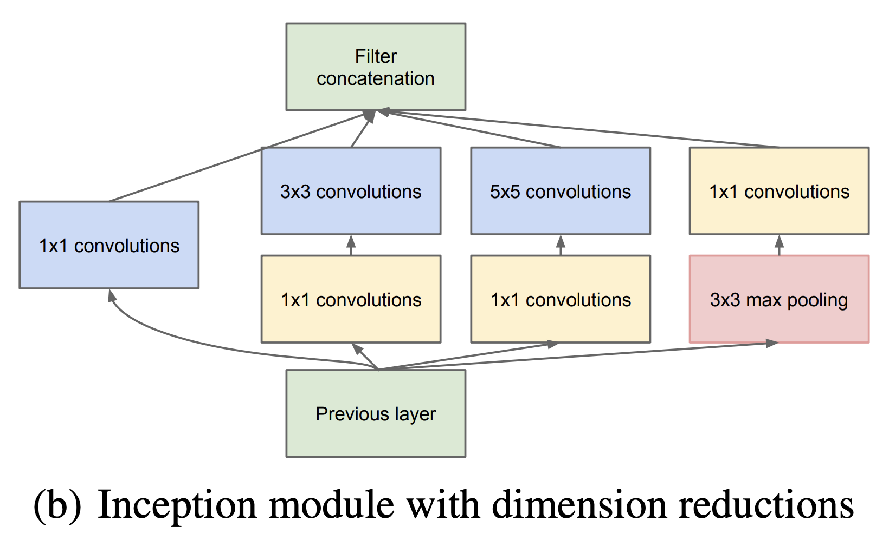

# [논문 리뷰 및 구현] GoogLeNet(2014) 리뷰 및 파이토치(PyTorch) 구현

- ILSVRC 2014에서 VGGNet을 제치고 1등을 차지했습니다.
- 1x1 convolution layer의 사용과 depth를 늘려서 모델의 성능을 향상 시켰습니다. (VGGNet과 유사함)
- Inception module과 Auxiliary classifiers를 사용했습니다.

## Architecture



- 전체적인 구조는 위와 같습니다. 얼핏 보기에는 엄청 복잡해 보이지만, Inception module을 9번 반복하여 사용하였기 때문에 찬찬히 살펴보시면 간단한 것을 알 수 있습니다.



- 총 Inception Module은 9개로 구성되어 있습니다.

## PyTorch Implementation

### Inception Module




```python

class InceptionModule(nn.Module):
    def __init__(self, in_channels, ch1x1, ch3x3_red, ch3x3, ch5x5_red, ch5x5, pool):
        super(InceptionModule, self).__init__()
        
        self.conv1x1 = nn.Conv2d(in_channels, ch1x1, kernel_size=1)
        
        self.conv3x3 = nn.Sequential(
            BaseConv2d(in_channels, ch3x3_red, kernel_size=1),
            BaseConv2d(ch3x3_red, ch3x3, kernel_size=3, padding=1)
        )
        
        self.conv5x5 = nn.Sequential(
            BaseConv2d(in_channels, ch5x5_red, kernel_size=1),
            BaseConv2d(ch5x5_red, ch5x5, kernel_size=5, padding=2)
        )
        
        self.pool = nn.Sequential(
            nn.MaxPool2d(kernel_size=3, stride=1, padding=1),
            BaseConv2d(in_channels, pool, kernel_size=1)
        )
        
    def forward(self, x):
        x1 = self.conv1x1(x)
        x2 = self.conv3x3(x)
        x3 = self.conv5x5(x)
        x4 = self.pool(x)
        
        return torch.cat([x1, x2, x3, x4], 1)
    
class BaseConv2d(nn.Module):
    def __init__(self, in_channels, out_channels, **kwargs):
        super(BaseConv2d, self).__init__()
        self.conv = nn.Conv2d(in_channels, out_channels, **kwargs)
        self.ReLU = nn.ReLU(inplace=True)
        
    def forward(self, x):
        return self.ReLU(self.conv(x))
```

- 먼저 **Inception Module**부터 살펴보겠습니다. 표에 나와있는 것처럼 `#1x1` `#3x3 reduce` `#3x3` `#5x5 reduce` `#5x5` `pool proj`을 반영하여 사용할 수 있도록 함수를 구성했습니다.
- Inception Module은 `1x1` `3x3` `5x5` `pool` 로 이루어져 있는데, 이를 통해서 상대적으로 Dense한 submatrix를 만들었습니다.
- 또한 다양한 filter를 가진 convolution을 추가하게 되면 그만큼 연산량이 많아지게 되는데, 이를 1x1 convolution을 사용하여 channel 수를 줄이며 진행했습니다.

### Model

```python
class GoogLeNet(torch.nn.Module):
    def __init__(self, in_channels, num_classes):
        super(GoogLeNet, self).__init__()

        self.training = True
        
        self.conv1 = nn.Sequential(
            BaseConv2d(in_channels, 64, kernel_size=7, stride=2, padding=3),
            nn.MaxPool2d(kernel_size=3, stride=2, padding=1),
            nn.LocalResponseNorm(2)
        )

        self.conv2 = nn.Sequential(
            BaseConv2d(64, 64, kernel_size=1),
            BaseConv2d(64, 192, kernel_size=3, padding=1),
            nn.LocalResponseNorm(2),
            nn.MaxPool2d(kernel_size=3, stride=2, padding=1)
        )

        self.inception_3a = InceptionModule(192, 64, 96, 128, 16, 32, 32)
        self.inception_3b = InceptionModule(256, 128, 128, 192, 32, 96, 64)
        self.maxpool_3 = nn.MaxPool2d(kernel_size=3, stride=2, padding=1)

        self.inception_4a = InceptionModule(480, 192, 96, 208, 16, 48, 64)
        self.aux1 = AuxModule(512, num_classes)

        self.inception_4b = InceptionModule(512, 160, 112, 224, 24, 64, 64)
        self.inception_4c = InceptionModule(512, 128, 128, 256, 24, 64, 64)
        self.inception_4d = InceptionModule(512, 112, 144, 288, 32, 64, 64)
        self.aux2 = AuxModule(528, num_classes)

        self.inception_4e = InceptionModule(528, 256, 160, 320, 32, 128, 128)
        self.maxpool_4 = nn.MaxPool2d(kernel_size=3, stride=2, padding=1)

        self.inception_5a = InceptionModule(832, 256, 160, 320, 32, 128, 128)
        self.inception_5b = InceptionModule(832, 384, 192, 384, 48, 128, 128)

        self.avgpool = nn.AdaptiveAvgPool2d((1,1))
        self.dropout = nn.Dropout2d(p=0.4)
        self.fc = nn.Linear(1024, num_classes)
        
    def forward(self, x):
        x = self.conv1(x)
        x = self.conv2(x)
        
        x = self.inception_3a(x)
        x = self.inception_3b(x)
        x = self.maxpool_3(x)

        x = self.inception_4a(x)
        if self.training:
            out1 = self.aux1(x)

        x = self.inception_4b(x)
        x = self.inception_4c(x)
        x = self.inception_4d(x)
        if self.training:
            out2 = self.aux2(x)

        x = self.inception_4e(x)
        x = self.maxpool_4(x)

        x = self.inception_5a(x)
        x = self.inception_5b(x)

        x = self.avgpool(x)

        x = torch.flatten(x, 1)
        x = self.dropout(x)
        x = self.fc(x)                
        if self.training:
            return [x, out1, out2]
        else:
            return x
    
    def set_train(self):
        self.training = True
        
    def set_eval(self):
        self.training = False
        

class AuxModule(nn.Module):
    def __init__(self, in_channels, num_classes):
        super(AuxModule, self).__init__()

        self.avgpool = nn.AdaptiveAvgPool2d((4,4))
        self.conv1 = BaseConv2d(in_channels, 128, kernel_size=1)
        self.fc = nn.Sequential(
            nn.Linear(4*4*128, 1024),
            nn.ReLU(inplace=True),
            nn.Dropout2d(p=0.7),
            nn.Linear(1024, num_classes)
        )

    def forward(self, x):
        x = self.avgpool(x)
        x = self.conv1(x)
        x = torch.flatten(x, 1)
        return self.fc(x)
```

- 모델 구조는 특별한게 없었습니다. 논문에 나와있는 그림과 표에 맞춰서 블록을 쌓아서 진행했습니다.
- 다만 모델의 깊이가 깊어진 만큼, Backpropagation을 진행할 때 gradient가 소실되는 문제가 발생할 가능성이 높아집니다. 해당 논문에서는 Auxiliary head를 두어 시작 부분까지 역전파가 잘 진행될 수 있도록 했습니다.
- model의 forward 함수가 3개의 값을 return하는 것을 확인하실 수 있습니다.

이에 따라, loss를 설정하는 방식이 다음과 같아집니다.

loss1과 loss2에 0.3을 곱한 이유는 최종 output보다 영향력을 적게 하기위함이라고 생각하시면 됩니다.

```python
pred0, pred1, pred2 = model(images)
loss0 = F.cross_entropy(pred0, targets)    
loss1 = F.cross_entropy(pred1, targets)    
loss2 = F.cross_entropy(pred2, targets)    

loss = loss0 + 0.3 * loss1 + 0.3  * loss2
```

코드 전문은 다음 링크에서 확인하실 수 있습니다.

[깃허브](https://github.com/Devlee247/PyTorch-Implementations/blob/master/CNN/GoogLeNet.ipynb)

### 구현 포인트

- 1x1 convolution
- Inception Module
- auxiliary head

## 마무리

- dense → sparsely 구조로 바꾸는 과정 속에서, 어떠한 가설을 가지고 진행했는지 자세하게 살펴볼 수 있어서 좋았습니다. 특히 해당 방향이 이후의 다양한 논문들에게도 영향을 주지 않았나 싶습니다.
- 또한 현재는 1x1 convolution을 기계적으로 사용하는 것 같은데, 당시의 시대적 상황과 연계하여 어떻게 1x1이 나왔는지에 대해서 좀더 자세히 이해할 수 있어 좋았습니다.

## 참고자료

[https://arxiv.org/pdf/1409.1556.pdf](https://arxiv.org/pdf/1409.1556.pdf)

[https://phil-baek.tistory.com/entry/3-GoogLeNet-Going-deeper-with-convolutions-논문-리뷰](https://phil-baek.tistory.com/entry/3-GoogLeNet-Going-deeper-with-convolutions-%EB%85%BC%EB%AC%B8-%EB%A6%AC%EB%B7%B0)