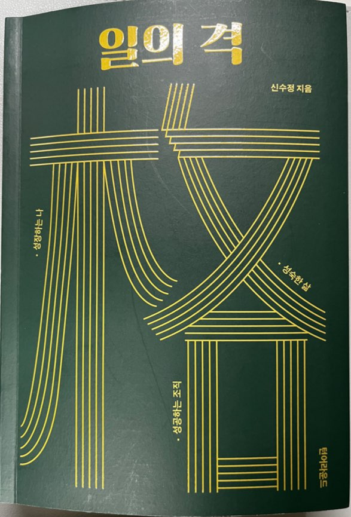

 

다음과 같이 **크게 세 파트**로 나누어져 있습니다.
- **성장**,  일의 성과를 극대화 시키는 기술
- **성공**,  조직을 성공으로 이끄는 리더십의 발견
- **성숙**,  일과 삶의 의미를 발견하는 방법

각 파트마다 **1-2 페이지의 짧은 글의 모음**으로 이루어져 있으며 틈틈이 읽기 좋은 책이었습니다.
특히 평소 삶과 관련해 고민을 했던 부분에 대해서 1:1 멘토링을 받는 느낌이었습니다.

각 파트별로 특히 **인상 깊었던 내용에 대해 소개**하고, 짤막하게 저의 생각을 공유하려 합니다.

### 성장

#### 그냥 찾아가라
> _잘하기 위해 찾아가는 것이다. 미리 잘 하려고 애쓰지 마라. 내가 좋은 평가를 받기 위해 고수를 찾아가는 것이 아니라 도움받기 위해 찾아가는 것이다._

- 항상 준비가 되면 찾아가야지 하다가 기회를 놓친 적이 많습니다.
- 아마 남들에게 부족해 보이는게 두려워 그랬던 것 같습니다.
- 결국에는 잘 하기 위해 찾아가는 것입니다.
- 부족해 보이는 것보다 진짜 부족한 것을 모르고 고치지 못하는 게 더 슬픈 일입니다.

#### 어려움과 고민이 들 때 답을 찾는 질문

일본의 호리에 노부히로 코치는 무엇을 해야 할지 모를 때 **스스로 답을 찾을 수 있는 5가지 질문**을 제시합니다.
> 1. 내가 얻고 싶은 결과는? (원하는 것)
> 2. 나는 왜 그것을 얻고 싶은가? (목적)
> 3. 어떻게 하면 그것을 실현시킬 수 있는가? (실현 전략)
> 4. 그것은 내 미래에 어떤 의미가 있을까? (의미)
> 5. 지금 내가 할 일은? (행동)

#### 초보 코치가 아니라 코치다
> - _"저는 초급 코치라서 아직도 배울게 많습니다. 더 배워야 하고 본격적인 사업은 내공이 쌓아진 다음에 하려 합니다"_
> - _알고보니 이미 코칭 과정을 몇 년이나 배웠고, 자격증도 있었으며 또 자신의 코칭이 실제 효과가 있었다고 한다. 그는 스스로 '초보'라는 말 뒤에 숨어 가능성을 제한하고 있었다._
> - _배우는 것이 나쁜게 아니다. 그러나 지나친 것은 부족함과 유사하다. 대개 당신이 선망하는 그 유명한 분들은 당신보다 더 어린 나이에 당신보다 더 부족한 지식으로 남들을 돕고 가르치기 시작했다._
> - _'신입'이나 '초보'라는 이름하에 숨을 이유가 없다. 그것은 겸손이 아니다. 프로의 세계에 들어가면 그때부터 프로인 것이고 프로답게 행동해야 한다._

- 항상 '배운지 얼마 안됐으니 괜찮아'라는 자세로 가능성을 제한하고 있었습니다.
- 저는 꿈이 크기에, 더이상 자신을 제한하는 행동은 그만하려 합니다.
- 프로답게 행동하겠습니다.

#### 효과적으로 배우는 방법은 비효율적으로 배우는 것이다
> - _나의 몸과 나의 생각을 많이 쓰는 과정일 수록 효과적이다._
> - _떠먹여 주는 강연이나 설교는 이해나 요약조차 필요 없다. 대개 스트레스 해소용, 작은 자극인 깨달음, 동기부여를 얻는 정도의 도움이 될 뿐 행동의 변화까지 연결되기 어렵다._
> - _스스로 몸과 머리를 쓰고 기록하고 실습하고 연습하고 자기가 이를 말로 이야기해봐야 한다._
> - _'귀찮음'과 때로 '지루함'을 이겨야 한다. 또 '돈과 시간의 낭비'가 필요하다. 변화하려면 비효율적으로 보이는 시간을 감내해야 한다._
> - _해당 과정이 없으면 결단코 '축적'되지 못한다._
> - _'축적'이 없으면 '발산'이 없고 진보도 미미해진다. 때로 진짜 '효과적'으로 배우는 법은 '비효율적'으로 배우는 것이다._

- 지금 이 순간을 **'축적'**하는 시기라 생각합니다.
- 후에 큰 **'발산'**을 이뤄낼 것입니다.

#### '처음부터 제대로'가 '민첩합'의 발목을 잡는다
> - _'처음부터 제대로'할 것이 아니라면 아예 실행하지 않는다. '실수'하거나 '실패'하려 하지 않는다. 성공과 인정의 욕구가 강할수록 더더욱 그러하다._
> - _일단 작게 실험해보고 피드백을 받으며 발전시켜가는 것이 훨씬 효과적이고 효율적이다._

- 저도 이전에는 **'처음부터 제대로'할 것**이 아니라면 실행하지 않았습니다.
- 행동을 하는 것과 하지 않는 것에는 **큰 차이**가 있습니다.
- 이 또한 남들의 시선이 두려워 '제대로가 아니라면' 시작하지 못하는 것일 수 있습니다.
- 이제는 그런 시선보다는 도태되는 게 더 두렵습니다.
- **일단 시작하겠습니다.**

### 성공

#### 다른 사람들에게 영감을 주려면?
> - _'I have a dream' 만일 마틴 루터 킹이 이렇게 하지 않고 'Have a dream!'이라고 했으면 어떠했을까?_
> - _나는 꿈이 있습니다'가 아니라 '여러분들 꿈을 가지세요'라고 했다면 역사가 바뀌지 않았을 것이다._
> - _세상은 꿈을 권고하는 사람을 따르는 게 아니라 자신의 꿈이 선명한 사람을 따른다._
> - _자신의 꿈을 선택하고 그것을 선포하면 된다._
> - _**I have a dream.**_

- 저도 **꿈을 강요하는 사람**보다는, 아름다운 **꿈을 꾸는 사람**을 동경하고 따르는 편인 것 같습니다.
- 저에게는 **큰 꿈이 있습니다.** 지켜봐 주세요.

#### 비효율이 효과적일 때가 있다
> - _사람 채용하고 관리하기가 제일 힘듭니다. 바쁜데 사람에 시간을 쏟는 것은 비효율적으로 보이고요. 한가하게 티타임 하거나 1:1 미팅하거나 식사 하는 것은 시간 낭비 같고요._
> - _리더들은 대개 효율에 익숙해있어 시간을 낭비하고 싶어 하지 않고 시간 대비 효과가 분명한 일에 집중하기 원한다._
> - _인간은 로봇도 AI도 아니다. 작은 감정에도 쉽게 흔들린다. 인간과의 신뢰 향상을 위해서는 비효율적인 것처럼 보이는 활동이 필수적이다._
> - _자녀를 효율적으로 대하는 부모, 애인을 효율적으로 대하는 남자친구를 생각해 보시라. 존경받고 사랑받을 수 있겠는가?_

- 저도 한때는 비효율적인 것들을 배제하며 살았습니다.
- 매사 모든 것들에 대해 효율을 따져가는 둥, 편협한 사고에 갇혀 살기도 했습니다.
- 마지막 줄이 특히 인상적이었습니다. _자녀를 효율적으로 대하는 부모, 애인을 효율적으로 대하는 남자친구 ..._ 과연 존경받고 사랑 받을 수 있을까요?
- 이제는 **비효율을 겸하며** 살아가려 합니다.

### 성숙

#### 조금은 빈둥거려도 괜찮다
> - _매시간 빈둥거린다면 문제가 있지만, 매 순간 100% 빡빡하게 사는 것도 위험하다._
> - _20% 정도는 여유를 가지는 것이 좋을듯하다._
> - _미래를 위한 고민도 하고, 가족과 책이나 자연을 즐기고, 비상 상황 시 백업으로 쓸 수 있다._

- 이 또한 위에서 언급한 것과 마찬가지 입니다.
- 제가 원하는 바를 이루기 위해 110% 빡빡하게 살기 위해 발버둥 쳤습니다.
- 하지만 남는게 없었습니다.
- 조금은 빈둥거리려 합니다.

#### 그게 다다
> 아버지와 아들간 이런 대화가 있다. 아들이 실수로 물을 쏟았다.  
> 아들 : _난 너무 칠칠치 못해요._ 
> 아버지 : _물을 쏟았을 때 할 말은 아닌 것 같다._ 
> 아들 : _뭐라고요?_ 
> 아버지 : _'물을 쏟았으니 닦을게요'라고 말하면 돼._ 
> 아들 : _그게 다예요?_ 
> 아버지 : _그게 다지_
> - _실수를 했으면 고치면 되고, 잘못을 하면 꾸중을 듣고, 성과가 안 나오면 교훈 삼아 다음에 잘하면 되고, 차였으면 다른 사람을 찾으면 된다._
> - _그게 다다._

- 정말 그게 답니다.
- 이미 일어난 일에 대해 자신을 자책하는 것은 아무 소용이 없습니다.
- 그저 그 일을 딛고 앞으로 나아가면 됩니다.

### 느낀점
전반적으로 좋았던 책이었습니다. 아마 앞으로도 자주 꺼내 읽을 것 같습니다.  
그 중에서도 특히 **'축적하여 발산한다'**라는 내용이 많이 있었는데, 현재 저의 상황과 비슷한 점이 많아 더욱 감명 깊었습니다.
  
지금 이 모든 **귀찮을 수도, 지루할 수도**있는 과정들 모두 제 자신을 축적하기 위한 길이라 믿고, 언젠가는 드넓은 하늘로 발산하리라 의심치 않습니다. 

**저에게는 원대한 꿈이 있습니다.**