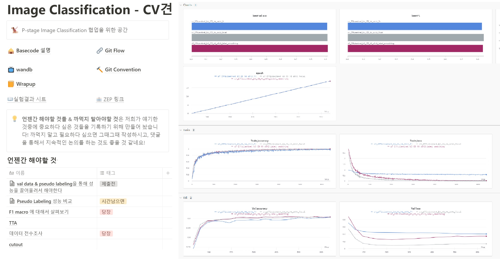
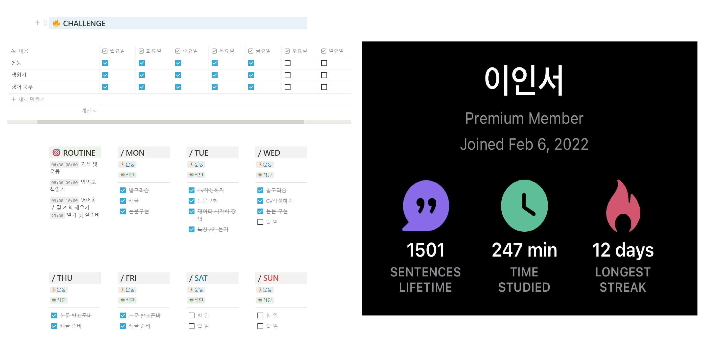

> _**Nothing worth having was ever achieved without effort.**_

2022년, 벌써 2달이 지난 후 정말 많은 변화가 생겼습니다. 
조금 이르긴 하지만 변화들에 대해 이야기를 풀어가려 합니다.

크게 달라진 것들을 중점으로 얘기 드리려 합니다.
> - **네이버 부스트캠프 AI Tech** 
> - **삶을 대하는 자세 - 일상의 루틴화**

## 네이버 부스트캠프 AI Tech

 아무래도 올해 들어서 겪은 **가장 큰 변화는 네이버 부스트캠프에서 공부를 하는 것**입니다. 대학원 진학과 취업 사이에서 고민을 하던 중 공부를 더 해야겠다 생각을 하고 이 과정을 선택했습니다. 나름 **도전적인 결정**이었는데 지금은 **부스트캠프를 선택하길 정말 잘했다**고 생각합니다.

 가장 좋은 점은 대단하고 엄청난 열정을 가지신 분들 많고, 그분들 사이에서 **'함께 자라기'**가 가능하다는 것입니다. 그분들을 보며 덩달아 자극을 받아 열심히 하게 되는 제 모습을 볼 수 있었습니다. 물론 그분들을 따라가지 못해 좌절감을 느끼는 순간도 많이 있었습니다. 하지만 **각자의 능력을 발현하는 시기가 다르다는 것을 알기에 조급해 하지 않고 열심히 축적**하고 있습니다.

### 첫 대회 - Image Classification

  
  <em>좌측부터 대회 과정을 기록한 노션, Wandb 실험 결과</em>

 약 2주 동안 대회를 진행했습니다. 기존의 오전 10시부터 오후 7시까지 진행되는 스케줄도 힘들다고 생각했었는데, 대회를 시작하고 나니 오히려 그때가 여유롭게 느껴졌습니다. 그만큼 밀도 있는 시간을 보냈습니다.

 대회를 처음 경험하다 보니 등수에 대한 목표보다는 **프로젝트를 진행하는 Flow를 경험**하는 것과 팀원과의 **효율적인 협업 방식**을 배우는 것, **대회 진행 방식**을 경험하는 것을 목표로 진행하였습니다. 좋은 팀원 분들과 멘토님을 만나 다양한 것들을 경험할 수 있었습니다.

 대회를 진행하고 나서 가장 크게 느낀 것은 역시 **대단한 분들이 많고, 공부가 더욱 필요하다**는 것입니다. 또한 프로젝트 내에서 맡을 수 있는 역할은 정말 다양하다고 느꼈습니다. 누군가는 리딩을 잘하고, 누군가는 모델링을 잘하고 저마다 다른 가치를 가지고 있습니다. 과연 **제가 가진 장점과 잘 할 수 있는 역할은 무엇일까** 생각을 하며, **자신만의 무기를 장착하는 것이 더욱 중요**하다고 깨달았습니다.

대회가 끝나고 약간 **'번아웃'**이 올 뻔 했지만, 다행히 마음을 다잡고 글을 쓰고 있습니다. 

## 삶을 대하는 자세 - 일상의 루틴화
  저는 지금 제가 겪고 있는 과정을 **하나의 오디션 프로그램**이라 생각합니다. 어린 시절 여러 경연 프로그램의 참가자들을 보면서 **'나에게도 저런 기회가 주어지면 모든 걸 바치고 열심히 할 텐데'**라고 생각을 했었습니다. 하지만 그런 기회가 막상 다가왔음에도 불구하고, 알아차리지 못하거나 최선을 다하지 못해 기회를 날리곤 했습니다.

  그런 기회라는 게 거창한 것이 아니라 **지금 이 순간**에도 와있을 수도 있다고 생각을 합니다. 이번에는 꼭 그 **기회를 놓치지 않기 위해 일상을 루틴화**하고, **시간을 좀 더 효율적으로 쓰고자 여러 노력**을 하고 있습니다.

### 1. 미라클 모닝
 가장 먼저 **미라클 모닝**을 실천하고 있습니다. 정규시간 외에도 **자기만의 공부를 위한 시간을 확보**해야 한다 느껴서 시작했습니다. 워낙에 부엉이 같은 생활 패턴을 갖고 있던 터라, **6시 반에 기상하는 것을 목표**로 시작했습니다. 처음엔 너무 힘들었으나, 차차 적응해 나가고 있습니다.

 덕분에 **오전에 운동할 시간과, 영어 공부와 책을 읽을 시간을 확보**할 수 있었습니다. 단순히 조금 일찍 일어난 것뿐인데 생각보다 정신적으로 많은 **긍정적인 성취감**을 느낄 수 있었습니다. 일단은 6월까지 유지하는 게 목표인데, 꾸준히 유지하기를 바랄 뿐입니다.

### 2. 기록

  
  <em>좌측부터 Notion에 기록한 내용, Speak 앱</em>

 기록의 중요성을 느껴 **모든 것들을 기록하기 시작**했습니다. 아직은 미숙하지만 Notion을 활용하여 하나하나 템플릿을 만들고, 기록을 습관화하기 위해 노력하고 있습니다.

### 3. 영어공부
 **자유롭게 회화**를 하기 위해 공부하고 있습니다. 미라클 모닝 덕분에 생긴 오전 시간을 할애하여 공부하고 있고, 현재 Speak 앱을 활용하고 있습니다. 나름 괜찮은 것 같다는 생각이 듭니다. 앞으로 listening 관련해서 공부 전략도 세워야 할 것 같습니다.

### 4. 운동
 손목이 아파서 제대로 된 운동을 진행하고 있지는 못합니다. 운동을 해야 더욱 집중해서 오래 공부를 할 수 있다는 걸 잘 알기에 어떻게든 **주 5회 이상** 운동을 가려 노력하고 있습니다. 그냥 눈을 뜨면 바로 헬스장으로 가고, 폼롤러로 몸을 풀면서 잠을 깨는 루틴이 생겼습니다. 얼른 손목이 나아서 좀 더 높은 강도로 운동을 진행하고 싶습니다.

### 5. 책 읽기
 대부분의 일정을 방 안에서 소화하기 때문에 외부 세계와 접할 기회가 부족합니다. 매너리즘에 빠지지 않기 위해 **매일 최소 15분 이상 책 읽기**를 하고 있는데, 아직까지는 집중력을 유지하기가 힘듭니다. 요새 '일의 격'이라는 책을 읽고 있는데, 많은 부분에서 자극과 위안을 받고 있습니다.

### 6. 커피 안마시기
 수면의 질을 높이기 위해 카페인을 최대한 안 마시려 한 게 어쩌다 보니 **한 달 넘도록 커피를 안 마시고 있습니다**. 나름대로 효과가 있는 거 같기도 하지만, 조만간 다시 마시게 될 것 같습니다.
 
### 더 해보고 싶은 것
* 명상
* 주기적인 논문 구현
* React native, Flutter 배워보기
* Rust 배워보기
* PS

하고 싶은 것들은 정말 많은데, 루틴화 되면 다음 회고 때 소개해 드리겠습니다.

## 마치며

정말 다양한 것들을 시도해 보고 실천해 본 두 달이었습니다. 나름대로 최선을 다했으며 밀도있는 시간을 보냈다 생각합니다. 매일 자극을 받고, 성장함을 느끼고 있습니다. **혼자 하는 게 아니라 다 같이 하는 것**이기에 이런 일정들을 소화하는 것이 가능하지 않았나 싶습니다. 앞으로도 **'같이의 가치'를 새기고, 이를 더 활용할 수 있도록 노력**하려 합니다.

그럼에도 불구하고 아쉬움이 남습니다. 루틴화 한 것들이 단순히 **시간 채우기 용** 혹은 **'영어 공부했다!'라는 위안을 주기 위한 것**으로 전락한 것이 아닐까 싶기도 합니다. 이렇게 되지 않기위해 주의하여 진행해야 할 것 같습니다. 앞으로도 지켜봐 주세요.

_**남들과 다른 길을 충실히 걸어가고 있는 모두 화이팅입니다! 😊**_