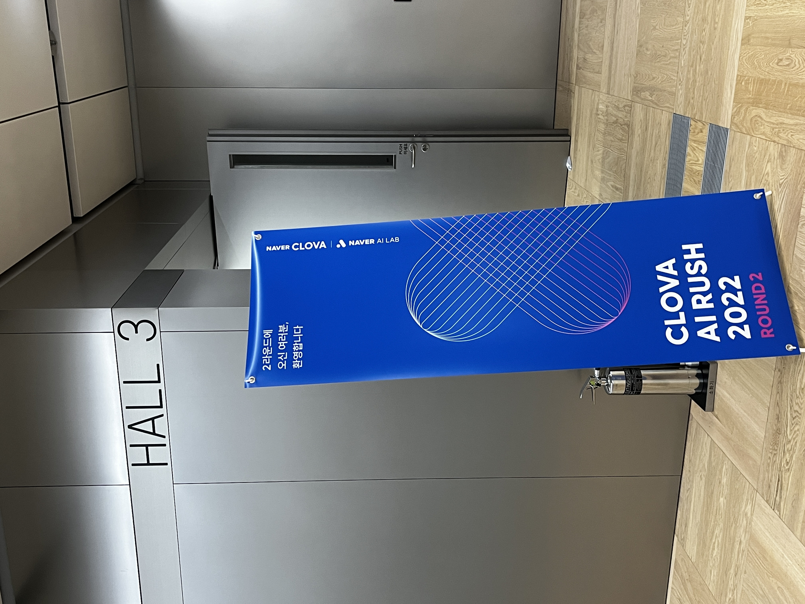

> _**Nothing worth having was ever achieved without effort.**_

## **1년을 돌아보자!**

2022년이 시작된 게 엊그제 같은데, 어느새 12월의 마지막을 향해가고 있네요. 과연 올 한 해 어떤 생각을 했는지, 어떠한 일들을 해왔으며 개선할 부분이 있는지 보고자 지난 1년을 되돌아보려 합니다.

## 2022년을 시작할 때의 나는?

 2021년에 SW마에스트로 과정을 거치고 나서 개발 분야에 대한 자신감과 확신은 생겼으나 딱히 내세울 만한 강점이 없었습니다. 그냥 어느 상황이 주어지면 공식 문서를 찾고, 공부하면서 개발할 수 있는 수준에 불과했습니다.

 당시 “안드로이드 개발을 주로 해요”, “리액트로 웹 프론트엔드 개발을 해요” 등을 자신 있게 말할 수 있는 사람들이 부러웠습니다. 이와 같이 자신 있게 말할 수 있는 주특기를 가지는 것이 중요하다 생각을 했고, 이에 인공지능을 주로 공부해야겠다고 다짐했습니다.

 즉, 22년에는 AI를 전문분야로 만들어가리라 다짐했고, 여러 가지 선택지 중에서 네이버 부스트캠프를 신청해서 많은 도약을 이루려 했습니다. 당시 막연하게 AI=대학원 필수라는 생각에 대학원 진학이라는 목표와 취업이라는 가능성 또한 열어놓고 2022년을 맞이했습니다.

## 올 한해의 흐름

 올 한 해는 다음의 활동들과 스터디들로 이루어져 있네요. 작년에 소마를 진행하면서 하나만 하기에도 정말 벅찼다고 생각했을 때, 소마 말고도 +@를 병행하는 다른 연수생의 회고 글을 보면서 자극을 받아 22년에는 비교적 **밀도 있는 한 해를 보내리라 다짐**했던 기억이 납니다.

- 네이버 부스트캠프 AI Tech (1월 ~ 6월)
- SW마에스트로 Expert (5월 ~ 11월)
- 네이버 클로바 AI Rush (6월 ~ 8월)
- 업스테이지 인턴 (9월 ~ 12월)
- 글 쓰기 스터디 (1월 ~ 6월)
- Kaggle 스터디 (1월 ~ 6월)
- 논문 리뷰 및 구현 스터디 (1월 ~ 6월)
- NLP 논문 리뷰 및 구현 스터디 (7월 ~ 9월)
- 알고리즘 스터디 (6월 ~ 8월)
- 대학원 진학 확정
- 아이슬란드 여행 - 12월

 돌이켜 생각해 보면 양적으로 밀도 있기는 했지만, 질적으로 밀도 있는 시간을 보냈는가에 대해서는 고민을 해봐야 할 것 같은 한 해였습니다.

### 네이버 부스트캠프 AI Tech

AI에 대해 많이 배울 수 있었고, 그와 더불어 다양한 스터디를 진행하면서 열정이 가득한 사람들을 보며 지치지 않는 힘을 얻었습니다. 가장 좋았던 점은 아무래도 네트워킹이 아닐까 싶습니다. 좀 더 자세한 후기는 [링크](https://devlee247.com/review/2022-06-12-boostcamp-review/)에서 확인하실 수 있습니다.

### **SW마에스트로 Expert**

기존의 멘토와는 다른 개념으로, 수료생으로서 연수생에게 소마 과정에 잘 적응할 수 있도록 상담을 해주는 역할을 진행했습니다. 본 경험을 통해서 열정 넘치는 연수생들을 보며 동기부여를 얻기도 하였고, 지식 전달의 노하우 또한 배울 수 있었습니다.

### 네이버 클로바 **AI Rush**

  
  <em>1784 사옥 내 HALL 3</em>

회사에서는 AI를 활용하여 어떤 문제를 푸는지에 대해 알 수 있던 경험이었습니다. 1차 통과 후 2차는 오프라인으로 진행됐는데, 네이버 신사옥인 [1784](https://1784.navercorp.com/) 건물은 정말 좋았고 밥도 맛있었습니다.

### **[업스테이지](https://www.upstage.ai/) 인턴**

  
  <em>제주도 워크샵에서 바라본 일몰</em>

이전부터 정말 일해보고 싶었던 회사였기에, 업스테이지에서의 인턴 경험은 그 자체로 배울 수 있는 부분이 너무 많았고, 행복한 순간이었습니다. 정말 다양한 background를 가진 사람들과 함께 일을 하고, 소위 ‘일잘러’라는 분들과 함께하면서 많이 성장할 수 있었습니다.

인턴이었음에도 불구하고 하나의 프로젝트를 진행할 수 있었고 타 회사 미팅, 제주도로 워크샵 등 정말 다양한 경험을 했습니다. 그와 동시에 앞으로 커리어를 그려나감에 있어 많은 생각이 들기도 했습니다. AI에 대한 확신은 있었지만 그 시장 속에서 어떻게 살아남을 수 있을까에 대한 고민이 들기도 하였습니다.

### 대학원 진학

고민 끝에 서울대학교 데이터 사이언스 대학원으로 진학을 결정하게 됩니다. 창업과 취업, 그리고 대학원이라는 세 가지 길에서 정말 많은 고민을 했었습니다.

창업과 취업, 그리고 대학원 각각의 길을 통해 얻고자 하는 것이 무엇인가를 생각해 봤을 때, 수단과 방법에서는 약간의 차이가 있을 수는 있지만, **AI를 활용하여 가치를 창출하는 것**이라는 결론을 내렸습니다.

현재의 제 상황들을 고려해 봤을 때, **대학원 진학을 하는 것이 AI를 활용하여 가장 많은 가치를 창출할 수 있다**는 생각하에 선택하게 되었습니다.

### **아이슬란드 여행**

  
  <em>아이슬란드 레이캬비크의 시내 전경</em>

어릴 적부터 버킷리스트 1순위였던 아이슬란드 여행을 다녀왔습니다. **자연을 보기 위해서는 자연과 맞서 싸워야 한다**는 것을 절실히 깨달았습니다. 생각보다 기상 상황은 좋지 않았고, 눈길 운전과 추위 등 쉽지 않은 여행이었습니다.
세상에는 정말 다양한 사람이 있다는 것을 배웠고, 해가 짧다(약 4시간)는 것과 추위와 눈보라 등 척박한 자연환경을 아직도 인간은 극복하지 못하고 있구나를 느꼈습니다. 

특히 기술이 많이 발전하긴 했으나, 저런 근본적인 문제조차 해결하지 못한다면 기술을 누리지 못한다고 생각이 들었고, 어떻게 해결할 방법이 없을까?에 대한 생각이 많이 들던 여행이었습니다.

## 올 한해 동안 잘한 것

### 자기개발(업무관련)에 대한 성과

- AI에 대한 전문성을 어느 정도 가질 수 있었습니다. → 물론 아직 많이 부족하긴 하지만…
    - 이전까지는 다양한 활동들에 대해서 주먹구구식으로 경험을 추구하면서 해왔다면 올해는 일관되게 경험들을 이어서 했습니다.
- 부스트캠프 과정 중에 팀 리더를 자처하여 협업과 관련된 다양한 경험을 하였고, 이를 통해 많이 배웠습니다. → 결과적으로 회사에서 쓰이는 모든 과정을 약식으로 배운 느낌
- 업스테이지에서 인턴 경험을 통해 회사 및 스타트업은 어떻게 돌아가는지 배울 수 있었고, 소위 ‘일잘러’들이 일 하는 모습을 보면서 앞으로 나 자신을 어떻게 발전시켜야 하는지에 대한 가이드라인을 배울 수 있었습니다. 또한 리더가 아닌 팀원으로 일을 해본 경험을 통해 지난날의 제 리더쉽을 반성하기도 하고, 역지사지가 되어 지난날의 팀원 또한 이해할 수 있었습니다.
- 1학기 마치고 바로 대학원 진학을 한 것이 아니라, 인턴 이후 다시 한번 나의 생각을 정리한 후 진학한 것이 정말 잘했다고 생각합니다. 연구 의지도 없이 대학원 진학을 했으면 정말 시간낭비였을 것 같습니다.

### 인간적인 성장(인성, 교훈 등)에 대한 성과

- 조급해 하지 않고 나 자신을 믿고 나아갈 수 있는 힘을 얻었습니다. → 어느 정도 성과가 났기에 지금처럼만 꾸준히 하면 되겠다라는 생각을 했습니다. 물론 좀 더 열심히 해야함을 느낍니다.
- 정말 다양한 사람들을 만났고, 네트워킹을 함. 이를 통해 우물 안 개구리는 면할 수 있었습니다. → 이전까지는(20,21) 사람들을 별로 만나지 않았고, 차라리 그 시간에 공부나 하자라는 주의였는데, 오히려 편협한 생각에 빠져 우물 안 개구리가 될 뿐이었습니다. 앞으로도 주기적으로 사람들을 만나 다양한 사고들을 공유하면서 내 틀을 깨부수고 더 좋은 방향으로 나아갈 수 있도록 하려 합니다.

### 그 외

- 여유를 느낄 틈 없이 다양한 활동들을 넣어서 많은 것들을 함
- 테니스를 배우기 시작했고, 운동들을 꾸준히 한 것
- 사진 찍는 취미를 시작함. 찰나의 순간들을 즐길 수 있게 됨

## 아쉬운 것

- 체력에 대한 과신
    - 계획을 과하게 짠 적이 있었습니다. 이로 인해 공부 혹은 자신을 발전시킬 시간을 조금은 침범한 듯 합니다. 이런 시행착오를 통해 수정해나가면 될 것 같습니다.
- 동기부여를 받아야만 열심히 함
    - 이 과정을 내가 좀더 적극적으로 해결했으면 더 좋지 않았을까 싶고, 커뮤니케이션을 통해 해결할 수 있지 않았을까? 생각이 들긴 합니다.
- 어느 순간부터 계획한대로 흘러가는 것이 아니라, 현생에 치여 결국 +@를 못하게 됨

## 내년에 도전할 것

22년에 여러 경험들을 겪고 대학원에 진학을 희망한 이상, 23년의 키워드는 아마 **‘연구’와 AI를 통한 가치 창출**이지 않을까 싶습니다. 그 목표에 따라 다음의 리스트를 작성했고, 최대한 지켜나가려 합니다.

- 논문 제출하기
    - 논문 리뷰
    - 논문 구현
- 영어회화 → 오랄발표, 해외인턴쉽 등
- 나이만큼 책 읽기
- 순수 개발 실력 키우기
- 다른 사람에게 도움이 되는 블로그 운영하기

어떻게 보면 현재까지 점으로 따로 존재하던 것들이 선으로 이루어진 첫 순간이지 않았나 싶습니다. 많은 자신감을 얻기도, 좌절을 하기도한 2022년 이었습니다. 이제는 연구자가 된 만큼 논문으로 제 가치를 증명해나가고 싶습니다. 다가올 2023년이 더욱 기대가 되고 설레는 순간이네요.

**Adios 2022,** 
**Bienvenido 2023!**