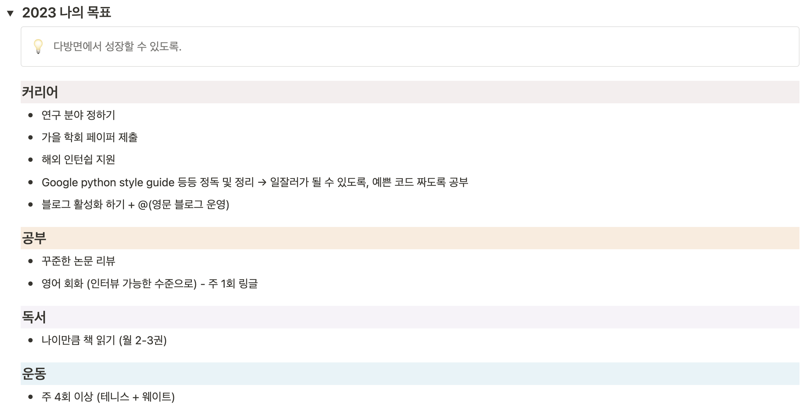
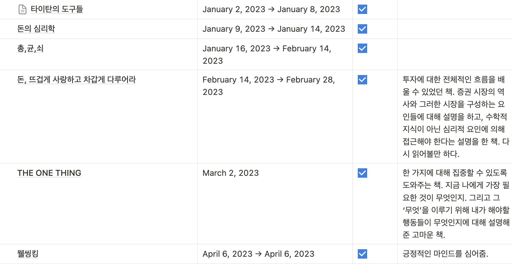
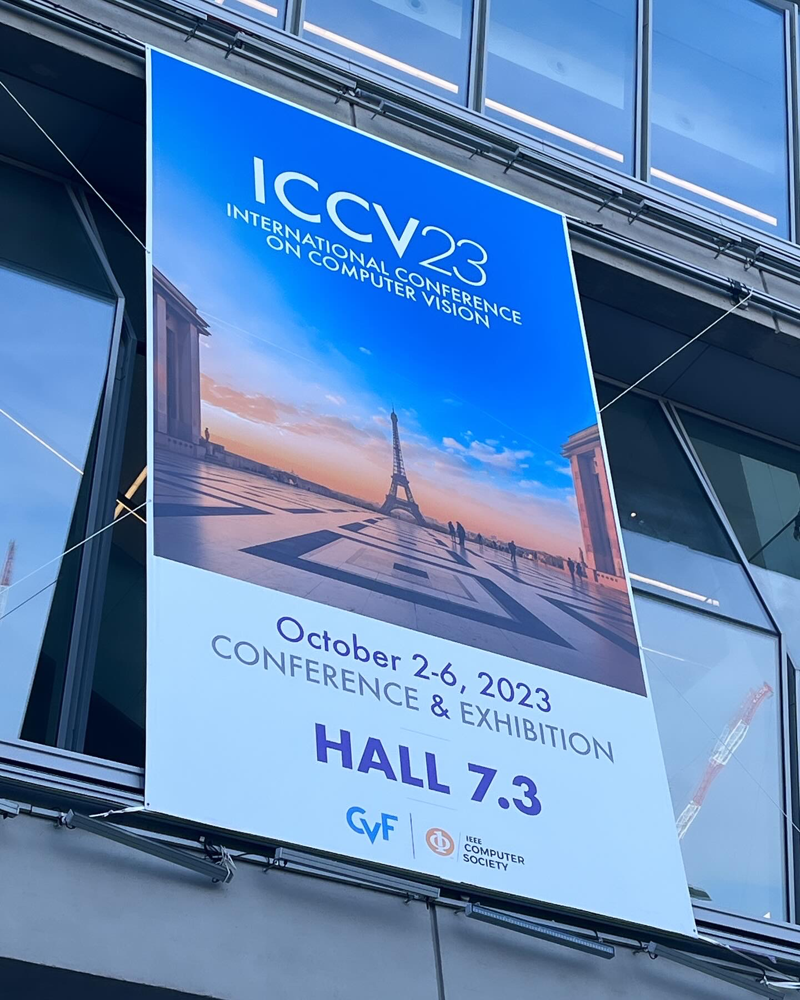
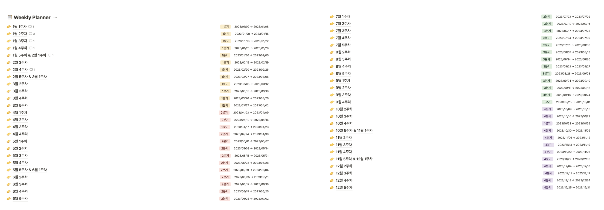
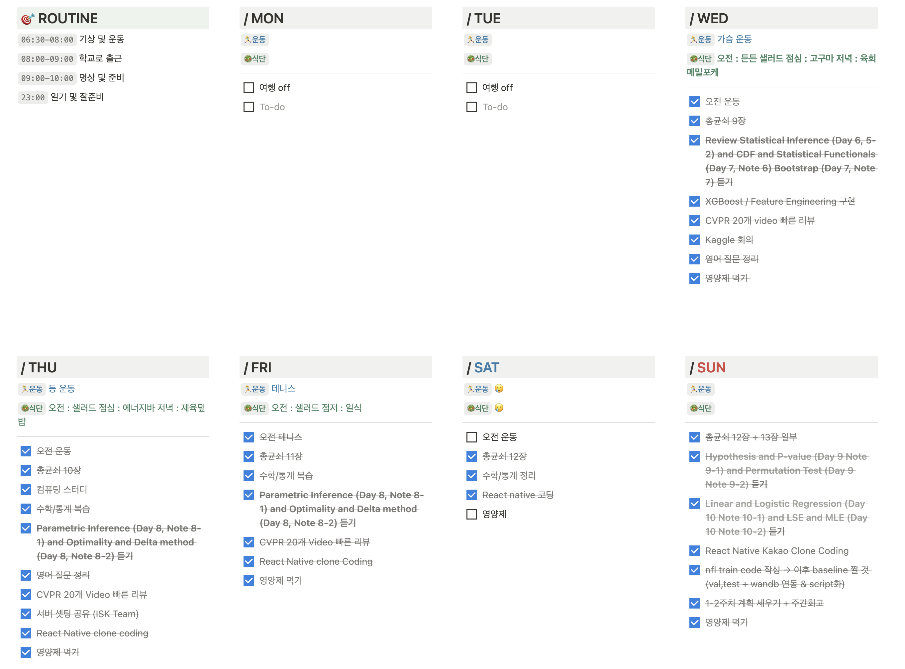

> _**Nothing worth having was ever achieved without effort.**_

# 2023년을 돌아보며

💡 ***간절히 바라던 것들을 이루고, 부족한 기본기를 깨닫고, 잘 할 수 있다는 자신감을 얻었지만, 건강 이슈와 번아웃을 곁들인***

올 한해를 요약하자면 ***“시작은 창대하지만 끝은 미약하리라”***입니다. 물론 더할나위 없이 많은 것들을 이루고, 성장을 했다고 생각하지만 한 해가 끝나갈 수록 아쉬운 점이 많이 남는 한 해였습니다.

## 2023년 나의 목표

  
  <em>2023년 나의 목표</em>

2023년 저의 목표였습니다. **연구 분야에서는 많은 성장을 했다고 느끼지만, “다방면으로 성장”했다기 보단 오히려 좁은 시야에 갇히지 않았나 반성**해봅니다.

### 커리어

- **연구 분야 정하기**
    - 정말 많은 고민을 했습니다. 특히 AI라는 분야의 특성상, 연구를 하고 싶다고 다 할 수 있는 것이 아니라 GPU 인프라 등 많은 부분을 고려해야 합니다. 때문에 연구실에서 할 수 있는 수준의 연구와 나의 관심사, 앞으로의 가치 등을 고려하여 주제를 선정하고자 노력하였습니다.
    - 최근에는 Implicit Neural Representation에 대해 큰 관심을 가지고 있습니다. 앞으로도 이 부분에 대해 공부를 해보려 합니다.
    - 연구를 하는게 재밌지만, 가끔은 견딜 수 없는 압박을 느끼는 순간들이 있습니다. 과연 좋은 논문이란 무엇일까에 대해 고민을 하게 되고, 쏟아지는 연구들 속에서 가치 있는 논문을 작성하고 싶습니다. 조금은 돌아가더라도 묵묵한 발걸음으로 나아가려 하지만, 이로 인해 뒤쳐지거나 늦어지는 것이 아닐까라는 불안감이 생기곤 합니다.
- **가을 학회 페이퍼 제출**
    - 좋은 연구실 동료들을 만나 2저자로 제출하는 경험을 하였습니다. 이 과정을 통해 많은 부족함을 느끼고, 앞으로 나아갈 방향성을 찾을 수 있었습니다.
    - 과연 내가 1저자로 논문을 완성할 수 있을까?에 대한 두려움이 있습니다. 앞으로 더 열심히 해야겠습니다.
- 이외의 목표들은 학업을 병행하다 보니 자연스럽게 뒷전으로 미뤄졌습니다. 아쉬운 부분이 많지만 해외 인턴쉽 지원은 내년의 목표로 한번 더 가져가려 합니다.

### 공부

- **꾸준한 논문 리뷰**
    - 특히 연초에 정말 많은 논문을 읽었습니다. 이로 인해 연구들에 대해 가지는 시야가 조금은 넓어지지 않았나 싶습니다.
    - 하지만 코스웍의 로드가 생각보다 많아서… 조금은 연구가 뒷전이 된 때가 있지 않나 싶습니다.
    - 연구에 대한 감을 유지하는 것은 매우 중요하다고 생각합니다. 가능한 흐름이 끊어지지 않도록 앞으로도 주기적으로 논문을 리뷰하겠습니다.
- **영어 회화**
    - 개인적으로 할 말이 많은 부분입니다… 어떻게든 하려고 많은 도전(링글, 전화영어 등)을 했지만 큰 성과는 얻지 못한 한 해였습니다.
    - 도저히 이대로는 안되겠다 싶어 최근 영어 회화 과외를 시작했습니다. 좋은 선생님을 만난 덕분에 실력이 조금씩 성장함을 느낍니다. 확실히  저에게는 다른 방법보다 누군가를 직접 만나서 영어로 많이 대화해보는 것이 잘 맞지 않나 생각이 듭니다.
    - 내년에는 꼭! 저의 생각을 자유롭게 영어로 말할 수 있는 날이 오기를 바랍니다.

### 독서

  
  <em>2023년간 읽은 책들</em>

처음에 목표를 세울 때도 쉽지 않겠다 생각했지만, 역시나였습니다. 30권은 커녕 읽은 책은 10권정도에 불과하지만…. 내년에도 나이만큼 책 읽기를 다시 도전해보고 이번에는 꼭 이룰 수 있도록 노력해보겠습니다.

### 운동

- 가장 아쉬운 부분입니다. 상반기에는 목표를 잘 이루다가 무릎을 다친 후 거의 운동을 하지 못했습니다.
- 운동을 거의 하지 못한게 끝이 미약해진 가장 큰 원인이라 생각합니다. 특히 건강이 정말 중요하다고 다시 한번 깨달았습니다.
- 다행히 무릎 통증이 거의 사라졌기에, 말일 기준으로 다시 헬스장을 등록하고 건강한 24년을 쟁취하고자 합니다.

## 올 한해의 흐름

- **대학원 코스웍**
    - 부트캠프(통계, 컴퓨팅) 부터 시작해서 1, 2학기 정규 학기 과정까지 정말 많은 것을 배웠습니다.

- **연구실 선정**
    - 대학원 지원 전부터 희망하던 연구실에 들어갈 수 있게 됐습니다. 많이 부족하다고 생각했기에 연구실에 오기 위해 많은 노력을 했습니다.
    - 들어오고 나서도 정말 좋은 동료들과 함께할 수 있다는 것이 너무 좋고 정말 많은 것을 배우고 있습니다.
    - 이제 본인만 열심히 하면 되겠다는 생각을 하고 있습니다.

- **ICCV’23 참석**

  
  <em>ICCV2023</em>

- 연구실에서 좋은 기회를 제공해 ICCV’23에 참가할 수 있었습니다. 전세계에서 모인 AI 전문가들과 그 논문들을 보며 정말 좋은 경험이었습니다.
- 좀더 큰 세계에서 논문을 쓰고 당당하게 발표를 해보고 싶다는 생각이 내내 들었습니다.
- 또한 네트워킹 기회가 있었는데, 부족한 영어 실력으로 인해 활발하게 얘기를 하지 못해 아쉬움이 남습니다. 내년에는 꼭 제 논문으로 해외에 참여할 수 있도록 여러 방면에서 노력하려 합니다.

  
  <em>Google Research Networking party</em>

적다보니 작년보다 양적으로는 한 것이 부족한데, 질적으로는 많은 것을 이룬 한 해이지 않나 싶습니다.

## **올 한해 동안 잘한 것**

  
  <em>2023년 매주 기록</em>

  
  <em>Weekly planner</em>

- 기록
    - 처음으로 꾸준하게 매주를 기록하고 관리하며 1년을 보냈습니다.
    - 물론 처음이다 보니 미흡한 부분도 많았지만, 그래도 꾸준히 했다는 것에 큰 점수를 주고 싶습니다.
    - 내년에는 더 나은 템플릿으로 앞으로의 삶에 대해 계속 기록하겠습니다.
- AI 기본기를 탄탄히 한 것.
    - 아직 많이 부족하지만 여러 부분에서 많은 기본기를 채워 넣었다고 생각합니다.

## 아쉬운 것

- 연구, 연구, 연구, 논문, 논문, 논문
    - 여러 코스웍에 치여 조금은 소홀하지 않았나 싶습니다.
- 체력 관리
    - 물론 무릎이 다쳐서 운동을 하지 못했다는 핑계가 있기는 하지만, 2학기의 삶은 못내 아쉬운 부분이 많습니다.
    - 특히 막판에는 번아웃과 싸우며 주어진 일들을 통제하는게 아니라 끌려다니는 경험을 하였습니다.

# 2024년에 도전할 것

아쉬운 점이 명확한 한 해였습니다. 이말은 즉 그 부분만 개선한다면 훨씬 더 나은 한 해를 보낼 수 있다는 것을 의미하겠죠. 이러한 아쉬움을 토대로 더 나은 24년을 보내고자 합니다.

- 1저자 논문 작성
- 영어 회화
- 연구에만 갇혀있지 않기
- 운동
- 잉여시간을 새로운 취미로 채우기 (기타 혹은 피아노)

**아무쪼록 이 글을 읽으시는 모든 분들에게 행복하고 성장하는 24년이 되기를 바랍니다.**