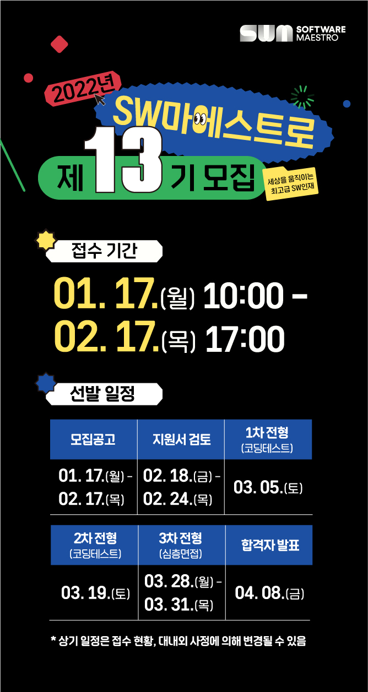
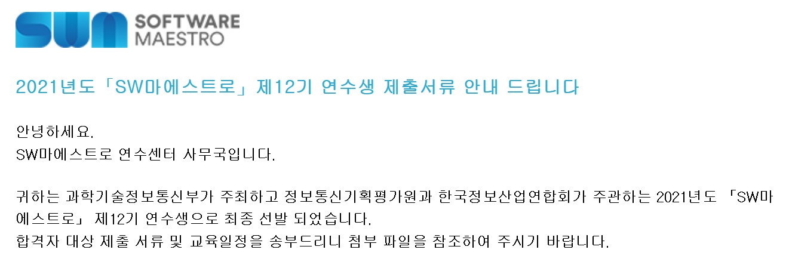
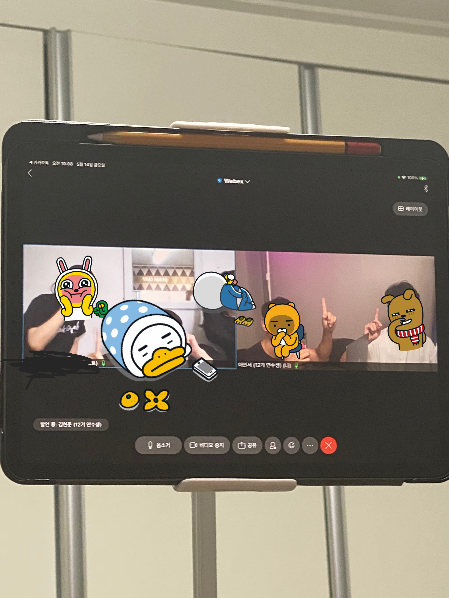

 

 과학기술정보통신부 및 정보통신기획평가원에서 **SW마에스트로 13기를 모집**한다고 합니다. 여러분들에게 본 프로그램을 추천하고, 제가 연수생으로 활동한 내용을 공유하기 위해 조금 늦었지만 **12기를 합격하게 된 얘기와, 활동 후기**를 작성하려 합니다.
 

# SW마에스트로란?
**SW마에스트로 과정**은 창의도전형 SW인재 육성으로 **SW산업의 미래를 선도하는 정부지원 사업**이며,
창의·도전형 프로젝트 기획·개발과 SW분야 최고 전문가들의 집중 멘토링 및 심화교육을 통해 **최고급 인재로 성장**할 수 있다고 합니다.
  
여러 **혜택 및 특전**은 [소마 홈페이지](https://www.swmaestro.org/sw/main/main.do)에 잘 나와있으니 생략하겠습니다.
 

---
# SW마에스트로 지원 및 합격
## 지원 계기
저는 **비전공자**이다 보니, 이런 정보를 얻을 경로가 없었습니다. 대부분의 연수생들을 보면 주변 사람들에게 추천을 받아서 하는 경우가 많은데, 저는 백준 홈페이지 배너에서 **우연히 정보를 얻어서 지원**하였습니다.  

사실 소마에 대해 들어본적이 없기 때문에 일단 어떤건가 보려고 소마 홈페이지에 들어갔습니다. 그런데 **생각보다 지원도 많고, 멘토분들도 대단하신 분들**이 정말 많았습니다. 이후 더 찾아봤더니, 원래 **유명한 프로그램**이었고 저만 몰랐던 거였습니다.  

당시에 4학년에 올라가긴 하지만, 이미 학과 수업들은 거의다 들은 상태여서 학업과 병행하며 진행할 수 있다 판단하였습니다만, **연구실 인턴과 소마 활동**사이에서 고민하긴 했었습니다. 하지만 다음 요소들로 인해 소마를 선택하게 되었습니다.
  
* 비전공자인 나는 많은 개발자를 만나는 것이 중요하다. 소마 활동을 통해 **개발자 네트워크를 구축**할 수 있으리라 믿었다.
* 항상 창업에 꿈이 있었다. **창업을 하는 과정**을 배울 수 있다고 생각하였다.
* 연구실 인턴은 나중에 해도 된다. 하지만 소마는?
* 지원이 빵빵하다.

## 서류 접수
서류에 작성해야할 항목은 **4개**가 있었습니다. **자기소개 항목 2가지, 연수 계획 항목 2가지**입니다. 상세 내용은 다음과 같습니다.

### 자기소개
* **[자기소개1] 소프트웨어 분야 전문성을 키우기 위해 남들과 달리 특별한 노력을 한 경험을 서술해 주시기 바랍니다**
* **[자기소개2] 귀하의 장래희망을 서술하여 주시기 바랍니다. (최소 400자, 최대 3,000자 입력가능)**

### 연수계획
* **[연수계획1] 귀하께서는 2021년도 「SW마에스트로」 연수과정에서 동료 연수생들과 협력하여 새로운 프로젝트를 완성하여야 합니다. 어떠한 능력을 갖춘 연수생들과 어떠한 프로젝트를 어떻게 수행할 것인지 귀하의 구체적인 계획을 서술하여 주시기 바랍니다. (최소 400자, 최대 3,000자 입력가능)**
* **[연수계획2] 2021년도 「SW마에스트로」 연수 과정에서는 연수생에게 교육지원비, 노트북PC 및 프로젝트 재료비 등을 지원할 예정이며, 본인이 희망하는 온·오프라인 교육과 프로젝트 수행을 도와주는 멘토를 통해 귀하의 SW능력을 향상·발전 할 수 있는 기회를 제공하고 있습니다. 앞으로 귀하께서 본 과정을 통해 이루고자 하는 목표가 무엇인지 구체적으로 서술하여 주시기 바랍니다. (최소 400자, 최대 3,000자 입력가능)**

 
솔직히 3000자 제한은 너무 많았습니다. 최대한 채워보려고 했으나, 포기하고 **적당히 작성해서 제출**하였습니다. SW마에스트로 취지에 맞게 모든 글의 내용에 **창업을 희망하는 내용이 들어가도록 구성**하여 작성하였습니다.
  
사실 서류는 대부분 붙는다고 하여서 걱정이 없었고, 이후 면접때 관련 질문이 나온다는 얘기를 듣고 작성 내용을 기록하긴 했습니다. 여러분들도 **노션 혹은 여러 툴을 활용하여 작성한 자기소개서 혹은 코딩테스트 내용들을 기록**해두는것을 추천합니다.
  
다음은 제가 작성한 자소서의 공백 포함 글자 수입니다. 도움이 될까 해서 공유합니다.
* 자기소개1 : 1892자
* 자기소개2 : 895자
* 연수계획1 : 1256자
* 연수계획2 : 970자

## 1차 코딩테스트
문제는 **알고리즘 6문제, 웹 1문제, SQL 1문제로 총 8문제가 출제**되었습니다. 당시 지원 전에 삼성SDS에서 알고리즘 특강을 수강하였기에, 알고리즘에 대해서는 따로 준비한 것이 없습니다. 다만 웹과 SQL부분이 정말 걱정이 되어 준비를 많이 하였습니다.

### WEB
웹과 관련해서는 생활코딩에서 **웹 강의를 들으며 HTML, CSS, JavaScript**가 어떻게 웹을 이루는지에 대해 공부를 하였습니다. 다행스럽게도 웹 문제는 그렇게 어렵게 나오지 않고, 단순히 Css를 활용하여 스타일을 적용하는 문제가 나와 풀 수 있었습니다. 아마 HTML태그의 종류에 대해 이해하시고, 스타일 및 스크립트가 어떻게 적용하는지 아시면 쉽게 접근하시리라 생각됩니다.

### SQL
SQL 문제에 대한 대비는 [프로그래머스의 SQL 고득점 Kit](https://programmers.co.kr/learn/challenges?tab=sql_practice_kit)를 전부 풀었습니다. 이것만 풀었는데도 어려움 없이 문제를 풀 수 있었습니다.
  
그 결과 알고리즘 5문제, 웹 1문제, SQL 1문제를 풀고 **1차 코딩테스트에 합격**하였습니다.

## 2차 코딩테스트
2차 코딩테스트 또한 **알고리즘 6문제, 웹 1문제, SQL 1문제로 총 8문제가 출제**되었습니다. 다만 전체적으로 조금씩 **난이도가 상승**한 느낌은 있었습니다.
  
중요한 것은 1차 코딩테스트 문제에서 심화가 된것이기 때문에, **1차때 알고리즘 문제들을 기록하고, 다시 한번 풀어보고 가실것을 추천**드립니다.
  
저는 그렇게 하질않아.. 1차문제에서 못푼 문제들을 2차때도 똑같이 풀지 못했습니다.
2차 또한 알고리즘 5문제, 웹 1문제, SQL 1문제를 풀고 **2차 코딩테스트에 합격**하였습니다.

## 면접
면접은 SW마에스트로가 있는 건물인 선릉역 근처 아남타워에서 진행되었습니다. 면접관들은 약 5-6명이 계셨던 것으로 기억이 나고, 지원자들도 5명으로 다대다 면접으로 진행됐습니다.
  
사실 면접 전에 가장 걱정된 것은 복장이었는데, **적당히 자유롭지만, 깔끔**하게만 입고 가면 됩니다. 정장을 입고 오신 분들도 간혹 계시긴 하였는데, 면접관분들도 아무도 신경을 쓰지 않는 분위기였습니다. 후드티도 가능할 듯 싶습니다. 아마 슬리퍼만 신지 않으면 되지 않을까요?
  
면접은 분과별로 따로 이루어진다고 합니다. 같은 연수생이라도 다른 면접관님을 만날 수도 있다는 것입니다. 
따라서 어떤 면접관분들이 계시냐에 따라 분위기가 달라집니다. 다행스럽게도 제 면접에서는 **기술 관련보다는 인성면접 위주**로 진행이 되어 대답을 잘 할 수 있었습니다. 하지만 기술 위주로 진행된 분과도 있다고 들었습니다.
  
기억나는 질문은 다음과 같습니다.

* 가장 좋아하는 언어와 가장 싫어하는 언어는?
* 팀원과 맞지 않을 때, 어떻게 할 것인가?
* 클라우드, 사물인터넷, 빅데이터 등(몇가지가 더있었는데 생각이 안나네요..)을 신체에 비유해서 표현해보세요.
* 코딩테스트에서 아쉬웠던 부분과, 이를 어떻게 보완할지?

사실 더 많았는데.. 기억이 안나네요. 이렇듯 기록하는 것은 정말 중요합니다 ㅠ_ㅠ
  
따라서 전략을 세우자면 다음과 같습니다. 아마 **다음을 준비하면 면접을 잘 보실 수 있으리라 생각**합니다.
* 60초 자기소개 준비
* 알고리즘 문제에 대한 풀이
* 개발과 관련된 최신 트렌드
* 창업하겠다는 의지 및 마음가짐을 어필
* 본인 분야 및 기술에 대한 준비
* 적어도 같이 들어간 지원자 중에서는 돋보이게 하기

이후, **합격**하였습니다.

코딩테스트부터 면접까지 기나긴 과정을 거쳐오면서, **합격할 거라고 생각을 한 적**이 없습니다. 코딩테스트를 합격하고 나서는 **'에이 면접에서 떨어지겠지'** 생각해서 자포자기 한 부분도 있었습니다. 아마 운좋게도 기술면접이 아니라 인성면접 위주로 진행이 되어 합격한게 아닐까 싶습니다.
  
이렇다할 개발 경험도 없었고, 토이프로젝트도 진행한 바 없었지만 합격하게 된 이상, 개발자로서 도약하는 기회라 생각하고 열심히 하리라 다짐하며 **연수 활동을 시작**하게 됩니다.
 

---
# SW마에스트로 활동
> SW 마에스트로 과정은 예비 과정(4~5월)과 본 과정(6~11월)으로 나뉘게 됩니다.

## 예비 과정 (4~5월)
예비 과정은 **크게 4가지**로 압축해서 얘기할 수 있습니다. `멘토님 찾기`, `팀원 찾기`, `미니프로젝트`, `해커톤`.
  
좋은 팀원 및 멘토님들을 찾는 것은 프로젝트의 성공과 직결된 부분이기 때문에, **모든 연수생들이 불을 키고 구애(?)의 활동**을 합니다. 코로나로 인해 오프라인에서 만나지 못하다 보니, SW마에스트로 홈페이지에 자기소개서를 올리고 서로에게 연락을 하는 방식으로 팀원을 찾아나섭니다.
  
또한 예비과정때에도 멘토님들이 수업을 여시거나 멘토링을 진행하시는데 이곳 저곳에 참여하면서 여러 멘토님들을 알아가고, 연수생들을 알아가며 연락을 주고 받습니다.
  
이 중에서 정말 인기 많으신 멘토님들은 연수생들로부터 연락을 많이 받으시기 때문에, 미리 **빠르게 연락을 드리는 것을 추천**합니다.
  
저는 운좋게도 좋은 팀원들과 멘토님들을 만나 정말 재밌게 프로젝트를 마무리 하였습니다.
  
이후 센터에서 지정해준 팀으로 진행하는 **미니프로젝트**와, 직접 팀원을 구해서 진행하는 **해커톤**을 마무리 하고 본 과정으로 들어가게 됩니다.
  
해커톤에 대한 기억은 정말 생생하게 남는데, **개발자 6명이 모여서 진행하는 해커톤**은 정말 흔치 않기 때문입니다.
당시 인원 제한으로 인해, 6명이 모두 한자리에서 만나지는 못했지만 4명 + 2명 따로 나눠서 Webex를 켜놓고 소통하며 밤새며 개발한 추억은 아마 평생 가져갈 듯 합니다.  

## 본과정 (6~11월)
이제 **본격적인 과정이 시작**됩니다. 원래는 소마 센터에서 개발을 진행할 수 있으나, **코로나 상황으로 인해 폐쇄**되어 다같이 모여서 할 수 있는 장소가 없었습니다. 어떻게든 효율을 높여 일을 진행하고 싶었던 터라, 지원비를 활용하여 사무실을 구하여 프로젝트를 진행하였습니다.

크게 `기획 발표`, `중간 발표`, `최종 발표` 세가지 발표가 있는데, 5개월 동안에 3개의 발표가 있다보니 정말 정신없이 흘러갑니다.
모든 발표가 **IR자료를 발표하는 것**처럼 심사위원 분들이 오셔서 평가하는 방식으로 진행이 됩니다. 이후 피드백을 제공해주시고, 프로젝트가 더 나은 방향으로 흘러갈 수 있도록 조언을 아낌없이 해주십니다.
  
저희가 진행한 프로젝트 내용에 대해서는 다음 링크에서 자세히 확인하실 수 있습니다! 
> [Fitsionary팀 인터뷰](https://blog.naver.com/sw_maestro/222536864206)
 

---
# SW마에스트로를 보내며
뛰어난 멘토님들과 연수생들과 함께하다 보니 활동을 하면서 정말 **수많은 것들을 배우고 얻었습니다**. 제 시야도 트인 것 같습니다.

어쩌다보니 **팀장** 역할을 맡았습니다. 프로젝트를 진행해본 경험이 전혀 없기 때문에 어떻게든 성공적으로 이끌기 위해 **정말 많은 것들을 고민**하였습니다. 팀원간의 생산성을 향상시키기 위해 여러 방법론들을 적용하기도 하였고, 툴들을 활용하기도 하였습니다.  
또한 개발자로서의 역량을 키우기 위해서 제가 맡은 부분에 대해 밤낮으로 공부하기도 하였습니다.  

다만 아쉬웠던 점은, 저의 개발 역량이 부족하여 소마 활동을 충분히 활용하지 못했다는 것입니다. 이 부분에 대해서는 **팀장으로서 팀원들에게 못내 미안한 부분**입니다.  

배운 것들은 다음과 같습니다.

* 창업 프로세스
* 개발 프로세스
* AI를 활용하여 프로젝트를 진행하는 방법
* 이외에도 협업하는 방법 등, 사람들과 커뮤니커이션 하는 방법

얻은 것들은 다음과 같습니다.

* 멘토님들과 돈독한 관계
* 수료생들과의 네트워킹
  

> **나는 무엇을 잘하는 개발자인가?**

그 중에서 가장 크게 배운 것은 바로 **개발자로서 제 자신을 뒤돌아 볼 수 있었다**는 점입니다. 이번 과정을 통해서 **기본기 및 기초의 부족함**을 많이 느꼈고, 과연 제가 **개발자로서 내세울 수 있는 역량**이 무엇이 있을까 고민하게 되었습니다. 자신있게 얘기할만한 것이 없었습니다. 끝나고 나서는 이 부분을 채우리라 다짐하였고, 이후 **네이버 부스트캠프 AI Tech에 지원**하여 **인공지능과 Computer Vision에 대해 깊게 공부**하려 합니다.
  

항상 그렇듯, 끝나고 나서야 **제대로 하지못한 부분에 대해 후회**가 남습니다. 제일 미련한 짓인 것 같습니다. 그때 더 열심히 할걸. 앞으로는 **매사에 최선을 다하자는 마음가짐 또한 얻었으며, 부스트 캠프에서 최선**을 다하려 합니다.
  
혹시나 지원을 고민하시는 분들은 **당장 지원하세요.** 생각 이상으로 많은 것들을 배울 수 있습니다.